# Getting started with DNSCrypt-Loader

DNSCrypt-loader is a flexible and customizable bash script to manage DNSCrypt-proxy using command line or Whiptail GUI.
If you are system adminitrator or common user this script is a handy way to setup DNSCrypt-proxy on your system

## Features
- Has no package dependencies (or almost), to keep it universal and easy to use.
- Runs in text mode, but uses Whiptail/Dialog interface which is pre-installed on most Linux distros.
- Automatic update of resolver.csv file from official source
- Signature verification of resolvers.csv file using Minisign. You can enable or disable resolver.csv integrity check.
- Automatic parsing of resolvers.csv file columns used on dnscrypt-proxy daemon execution parameters
- Sets primary and secondary DNS resolvers instances.
- Display of resolvers in a `whiptail` menu, that can be filtered to show only IPV4, IPV6 or show all resolvers.
Also, filters resolvers that do not create DNS query logs by default, but you can Change this behavior if you want.
- Sets a resolver randomly chosen by the DNSCrypt-loader, very useful for cyclical replacement schedule of resolvers using Cron.
- Can use command-line parameters in a task schedule using Cron or at boot time.
- Start, stop or restart Dnscrypt-proxy daemon by pressing a key or on the command line.
- Display Dnscrypt-proxy status information such as run time, name and IP of the current resolver, DNS resolution speed.
- Generating information in the system log for debugging.
- performs dns leak tests using third party site.
- Provides init script to control DNSCrypt-proxy as service.
- Script to install and uninstall DNSCrypt-loader resources
- Configurable IP/port instances
- Restores resolvers used on last DNSCrypt-proxy session

## Pre-requisites
  
A successful install of DNSCrypt-proxy.

**Optional**  
A successful install of Minisign (optional but highly recomended)  
Please refer to [https://github.com/jedisct1/minisign](https://github.com/jedisct1/minisign) to details.

**Commands dependant**  
`whiptail` (Pre-installed in most Linux distros)

## Compatibility
The scripts were written and tested using CentOS Linux release 7  
 and should be compatible with most Linux distributions based on Red Hat.  
Was tested in Debian based distros with success also. 

- CentOS, Fedora
- Ubuntu, Mint, Debian 

Versions of DNSCrypt-loader for other Linux distros will be available soon.

## know issues
Scripts that use the Whiptail can be difficult to debug because the interface hides some error messages. 
For this reason, despite all care on script writing, you can get stuck on a screen without being able to cancel the script, 
This may force you to cancel an SSH session or kill the frozen process.

## Installation

1. **Download and unpack DNSCrypt-loader**  
[https://github.com/GortCodex/DNSCrypt-Loader/archive/master.zip](https://github.com/GortCodex/DNSCrypt-Loader/archive/master.zip)

2. **Run DNSCrypt-loader installer as root**

On CentOS and Red Hat based distros 

	./install-loader-redhat 

On Ubuntu and Debian based distros 

	sudo ./install-loader-debian
 

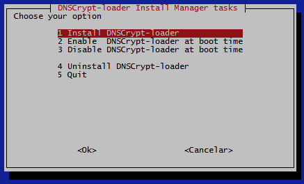

**Option 1 - Install DNSCrypt-loader**  

Creates config files on `/etc/dnscrypt-loader/`  
Copy the main script dnscrypt-loader to `/usr/local/sbin/`

**Option 2 - Enable DNSCrypt-loader at boot time**

If you need to load DNSCrypt-proxy at system start up  this option will copy the `dcp-loader` script to `/etc/init.d`.  
`dcp-loader` is a basic init script to load DNSCrypt-proxy at boot time
through the DNCrypt-loader.  
Please, refer to Using DNSCrypt-loader as service (dcp-loader) topic

**Option 3 - Disable DNSCrypt-loader at boot time**

Removes the dcp-loader script from `/etc/init.d`  
and disables loading of DNSCrypt-proxy at boot time

**Option 4 - Uninstall DNSCrypt-loader**

Removes all scripts and config files.  
If DNSCrypt-proxy is running it will not be interrupted.  
To prevents DNS query errors you need stop the proxy before uninstall.

## Prepare configurations

Before you start using dnscrypt-loader you may want to customize the script to meet your needs.  
If you prefer, leave the DNSCrypt-loader using default settings

**Edit dnscrypt-loader using your prefered editor**   

    vi /usr/local/sbin/dnscrypt-loader

Please note that after install the dnscrypt-loader you must edit it at  

    /usr/local/sbin/dnscrypt-loader

**What parameters can you modify?**

At begining of dnscrypt-loader script locate the ` Start Customizations` block  
and configure as following:

**The user who execute DNSCrypt-proxy**
  
It is strongly recommended that you change the root user  
by an unprivileged user to avoid security problems

    cChroot="root"

**IPs and ports used by DNSCrypt-proxy**  

Respectively, the local IP and port used by DNSCrypt-proxy to act as  
primary DNS and secondary DNS instances
  
    cPrimaryIP="127.0.0.1"
    cPrimaryPort="5553"
    cSecondaryIP="127.0.0.1"
    cSecondaryPort="5554"
    
    
**Path to DNSCrypt-proxy files**  

You only need to change the path to DNSCrypt-proxy files if you has customized the installation.  

Path to DNSCrypt-proxy application:

    cProxyBaseDir="/usr/local/sbin/"

Path to resolvers.csv file:

    cCSVBaseDir="/usr/local/share/dnscrypt-proxy/"

**Parameters used by DNSCrypt-proxy**  

If necessary, you can add or remove additional parameters used by DNSCrypt-proxy on  

    cOtherParams="--ephemeral-keys "

**URL to download resolvers.csv**  

Automatic resolvers.csv update uses this URL to download it  

    cCSVURL="https://download.dnscrypt.org/dnscrypt-proxy/dnscrypt-resolvers.csv"

**URL to download dnscrypt-resolvers.csv.minisig**  

Automatic resolvers.csv signature verification uses this URL to download it  

    cSIGURL="https://download.dnscrypt.org/dnscrypt-proxy/dnscrypt-resolvers.csv.minisig"

**URL to copy Public Key used by Minisign**  

When necessary you can copy Public key at [https://github.com/jedisct1/minisign](https://github.com/jedisct1/minisign)  

    cSIGKey="RWQf6LRCGA9i53mlYecO4IzT51TGPpvWucNSCh1CBM0QTaLn73Y7GFO3"

**Resolvers privacy level filter**  

Resolvers that holds some level of logging of DNS queries can be filtered to not be displayed on menu  
and not be included in the random selection of resolvers.  
Setting parameter to true will hide resolvers.  
This filter can be changed on script interface too

    cAnonymousOnly=true

**IP version filter**  

Resolvers that works with IPV6, IPV4 or both can be filtered to fit your network needs.  
Possible values to cIPVersion are "ipv4" or "ipv6" or "all"  
This filter can be changed on script interface too  
Please refer to [https://github.com/jedisct1/dnscrypt-proxy](https://github.com/jedisct1/dnscrypt-proxy) for IPV6 support details

    cIPVersion="ipv4"

**Resolvers.csv signature check using Minisign**
  
By default, this setting is disabled to allow you to install and configure Minisign.  
Please refer to [https://github.com/jedisct1/minisign](https://github.com/jedisct1/minisign)  
After that, you can set `cEnableSignCheck=true` and the integrity check will run properly 

    cEnableSignCheck=false

**Dig target domain to test DNS resolvers**  

DNSCrypt-loader uses `dig` to test DNS resolvers functionality and performance.  
You can put any domain you want.  
`cDigTries` is the number of tries to test the domain  
`cDigTime` is the time in seconds per try

    cDigTarget="internic.net"
    cDigTries=2
    cDigTime=5
    
**Interface type**  

You can select between "whiptail" or "dialog"  to customize the interface appearance.  
Both are pre-installed on most Linux distros

    cGUI="whiptail"

# Running DNSCrypt-loader  

**Run DNSCrypt-loader as root**

    dnscrypt-loader

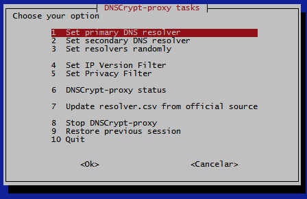

**Option 1 - Set primary DNS resolver**  

Select the resolver that will act as primary DNS using local IP and port previously configured.  
Please, refer to `What parameters can you modify?` topic
 

**Option 2 - Set secondary DNS resolver**

Select the resolver that will act as secondary DNS using local IP and port previously configured

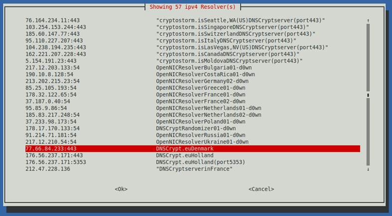

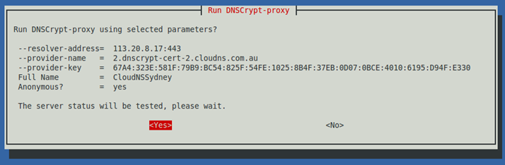

**Option 3 - Set resolvers randomly**  

Select this option If you prefer let the script randomly choose the resolvers.  
This option is available as command line parameter too, useful to change  
resolvers from time to time using `cron` or during system startup.

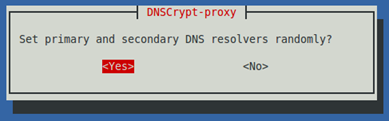

**Option 4 - Set IP version filter**  

Filters resolvers by IP version. Select IPV4, IPV6 or all  
This filter bypass the script parameter `cIPVersion` temporarily

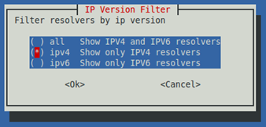

**Option 5 - Set privacy level filter**  

Filter resolvers by privacy level  
This filter bypass the script parameter `cAnonymousOnly` temporarily

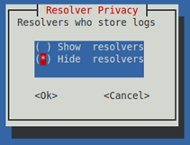

**Option 6 - DNSCrypt-proxy status**  

Show informations about DNSCrypt-proxy process

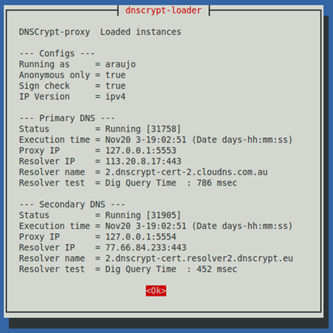

**Option 7 - Update resolvers.csv from official source**  

Performs download, update and signature check of the resolvers.csv file

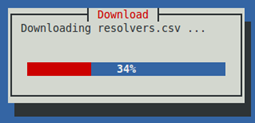

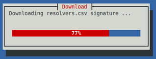

**Option 8 - Stop DNSCrypt-proxy**  

Stops all instances of DNSCrypt-proxy  
DNS queries will fail for proxy clients

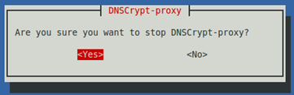

**Option 9 - Restore previous session**

Tries to reload the last primary and secondary resolver used by DNSCrypt-proxy

**The DNSCrypt-proxy process running**
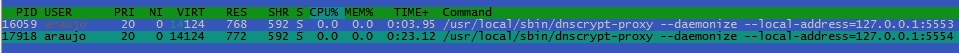

**DNSCrypt-loader system log entries**
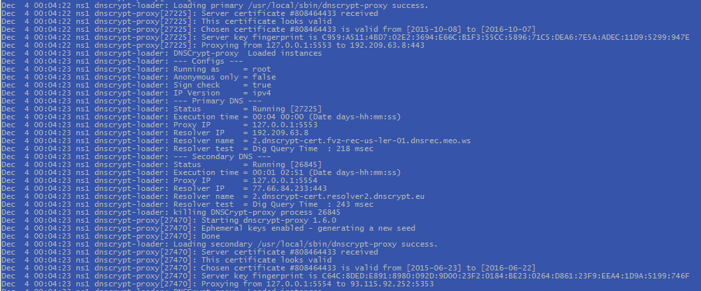

## Using command line options
Command-line options are useful when you want to run DNSCrypt-proxy through DNSCrypt-loader
in a script you created or as a scheduled task using Cron and so on, using as follows:

Show usage

    dnscrypt-loader -h

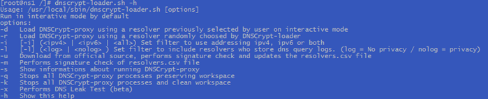

**Load resolvers**  

Loads the resolvers selected by user in interactive mode.
If no resolvers previously selected DNSCrypt-loader will select the resolvers randomly.

    dnscrypt-loader -d

**Load resolvers randomly**  

Does the same as the "-d" option, but uses random resolvers only.

    dnscrypt-loader -r

**Change filters**  

You can add filter modifiers to the options "-d" and "-r"  
the randomizer will restrict the resolvers to these filters. Example:

    dnscrypt-loader -i ipv4 -l nolog -r 
    dnscrypt-loader -i ipv6 -l log -d
    
**Update resolvers.csv**

Performs download, update and signature check of the resolvers.csv file

    dnscrypt-loader -u

**Minisign Signature check**  

Performs integrity check of resolvers.csv file using Minisign

    dnscrypt-loader -m

**Status**  

Show DNSCrypt-proxy instances status

    dnscrypt-loader -s

**Quit DNSCrypt-proxy**  

Stops all instances of DNSCrypt-proxy and preserves information about the resolvers used for further session restore

    dnscrypt-loader -q

**Kill DNSCrypt-proxy**  

Stops all instances of DNSCrypt-proxy and clears all information about the resolvers used

    dnscrypt-loader -k

  

**Performs DNS leak test (IPV4)**  
This function is just a command line bonus. It depends of third-party software that can be changed at any time.

Note: DNS-OARC is not a DNS Leak Test site itself but produces the exactly same results when we observe the DNS Servers tested.
This site was chosen because is secure and it does not use javascript, permitting download of data inside html code

No magic here. This function extracts the DNS IP addresses detected on [http://entropy.dns-oarc.net/test](http://entropy.dns-oarc.net/test) test page.
So you can check if the DNSCrypt-proxy resolvers you choosed really is working.

But the most important is verify if your real IP address is listed.
If yes, it means you are not protected by VPN or if you are using DNSCrypt-proxy as Forwarder on DNS (BIND) server,
the directive "Forward only;"  must be applied, since this server will forward all requests and should not attempt to resolve requests on its own, bypassing DNSCrypt-proxy.

Obviously, you can use DNS Leak test pages to do the same.  
Please refer to [https://www.dns-oarc.net/](https://www.dns-oarc.net/) for details

  
    dnscrypt-loader -x

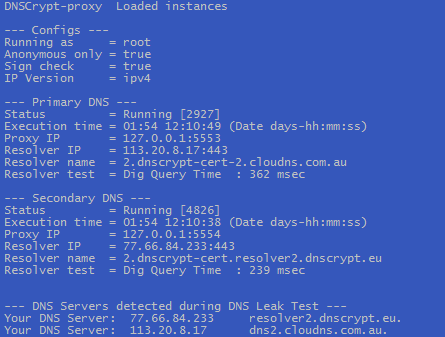

## DNSCrypt-loader Configuration files

DNSCryp-loader uses two config files located in`/etc/dnscrypt-loader/`
This files contains parameters used by DNSCrypt-proxy instances called primary and secondary DNS resolvers.
    
    dcp-primary.conf
    dcp-secondary.conf

The contents of the files is updated every successful execution of DNSCrypt-proxy using user selected resolvers or randomly loaded by script.

The DNSCrypt-loader retrieves these parameters when you restore a previous session or during system startup.
Only well-known DNSCrypt-proxy parameters are read and processed.

## Using DNSCrypt-loader with cron

In this example we add two entries in crontab, as folow:  

The resolvers.csv file will be updated everyday at 23:00pm  
New resolvers will be loaded randomly everyday at 13:00pm

    # For details see man 4 crontabs

    # Example of job definition:
    # .---------------- minute (0 - 59)
    # |  .------------- hour (0 - 23)
    # |  |  .---------- day of month (1 - 31)
    # |  |  |  .------- month (1 - 12) OR jan,feb,mar,apr ...
    # |  |  |  |  .---- day of week (0 - 6) (Sunday=0 or 7) OR sun,mon,tue,wed,thu,fri,sat
    # |  |  |  |  |
    # *  *  *  *  * user-name command to be executed
    0 23 * * * * root exec /usr/local/sbin/dnscrypt-loader -u
    0 13 * * * * root exec /usr/local/sbin/dnscrypt-loader -r

## Using DNSCrypt-loader with BIND DNS server
You can redirect DNS requests of whole network to a DNS Bind server that will act as a forwarder only.  
To do this, just put ip/port of DNSCrypt-proxy you set up on DNSCrypt-loader  
inside of Bind `forwarders` clause.  
Then, your DNS clients can point to your Bind server to forwarded DNS queries.

As follows:

    options {
     ...
    forward only;
    forwarders {127.0.0.1 port 5553;  127.0.0.1 port 5554;};
     ...
    }

A more selective version this setting is to use the Bind `view` clause for a specific set of DNS clients  
that will be forwarded through DNSCrypt-proxy. For example:

    acl ProxyClients { 192.168.1.0/24;  };
      ...

    view "PROXY-NETWORK" {
    match-clients { ProxyClients; };
    recursion yes;
    forward only;
    forwarders {127.0.0.1 port 5553;  127.0.0.1 port 5554;};
      ...
    };

Please, refer to Bind documentation.

## Using DNSCrypt-loader as service (dcp-loader)

You can enable or disable DNSCrypt-loader as service using the installer, please refer to Installation topic.  
Remember that the service mode is needed to load DNSCrypt-proxy resolvers at boot time.  
To control all details of DNSCrypt-proxy use the dnscrypt-loader script.
  
Once service is enabled, depending on your Linux distro, you can control the service as follow:

**On Centos and RedHat based**

    service dcp-loader start|stop|restart|status  
    or
    systemctl start|stop|restart|status dcploader.service

**On Ubuntu and Debian based**

    sudo service dcp-loader start|stop|restart|status

----------

Hope you enjoy using DNSCrypt-loader to manage DNCrypt-proxy.
